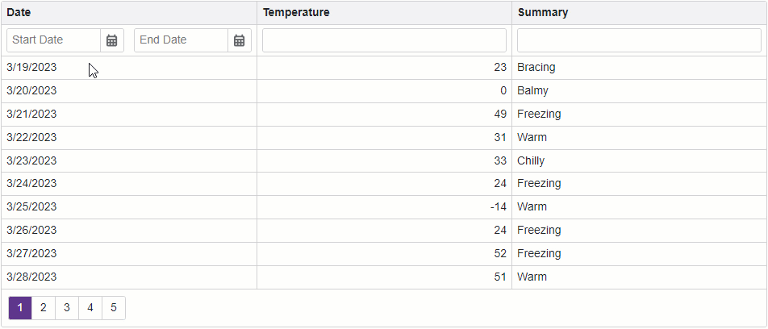

<!-- default badges list -->

<!-- default badges end -->
# Grid for Blazor - How to implement a date range filter in a filter row

This example demonstrates how to allow users to filter a column in the [DevExpress Blazor Grid](https://docs.devexpress.com/Blazor/403143/grid) by a date range. In the example, the [filter row](https://docs.devexpress.com/Blazor/404325/components/grid/filter-data/filter-row) displays two [Date Edit](https://docs.devexpress.com/Blazor/DevExpress.Blazor.DxDateEdit-1) components in the **Date** column. These components allow you to set the start and end dates of a date range. Once you set both dates, the Grid filters the column by the range.

You can also incorporate a date range filter in a [column filter menu](https://docs.devexpress.com/Blazor/404417/components/grid/filter-data/filter-menu). Refer to the following documentation section for more information and an example: [Custom Filter Menu Content (Template)](https://docs.devexpress.com/Blazor/404417/components/grid/filter-data/filter-menu#custom-filter-menu-content-template).

## Overview

Follow the steps below to allow users to filter a grid column by a date range:

1. Add a Grid component to a page and bind the component to data.

2. Set the component's [ShowFilterRow](https://docs.devexpress.com/Blazor/DevExpress.Blazor.DxGrid.ShowFilterRow) property to `true` to display the filter row.

3. Specify the [FilterRowCellTemplate](https://docs.devexpress.com/Blazor/DevExpress.Blazor.DxGridDataColumn.FilterRowCellTemplate) property of a column that displays dates. In the template, create two [Date Edit](https://docs.devexpress.com/Blazor/DevExpress.Blazor.DxDateEdit-1) components where users can set the start and end dates of a range.

4. Implement [two-way data binding](https://docs.devexpress.com/Blazor/402330/common-concepts/two-way-data-binding) between [Date](https://docs.devexpress.com/Blazor/DevExpress.Blazor.DxDateEdit-1.Date) properties of the Date Edit components and the data fields that store endpoints of the range.

5.  Handle [DateChanged](https://docs.devexpress.com/Blazor/DevExpress.Blazor.DxDateEdit-1.DateChanged) events of the Date Edit components. In a component's event handler, assign the component's new value to the corresponding endpoint of the date range. If the start date of the range exceeds the end date as a result, update the other endpoint value. Once both endpoints of the date range are set, create the filter criteria that determine whether the current value is in the range. Apply the filter criteria to the grid column.

## Files to Look At

- [Index.razor](./CS/Pages/Index.razor)

## Documentation

- [Filter Data](https://docs.devexpress.com/Blazor/403143/grid#filter-data)
- [Examples](https://docs.devexpress.com/Blazor/404035/grid/examples)

## More Examples

- [Grid for Blazor - Incorporate a selector for filter row operator type](https://github.com/DevExpress-Examples/blazor-dxgrid-filter-operator-selector)
- [Grid for Blazor - Use the DxTagBox control to filter a column against multiple values](https://github.com/DevExpress-Examples/blazor-grid-use-the-DxTagBox-control-as-a-filter-for-a-column-with-multiple-values)
<!-- feedback -->
## Does this example address your development requirements/objectives?

 

(you will be redirected to DevExpress.com to submit your response)
<!-- feedback end -->
