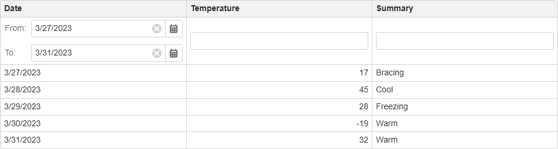

<!-- default badges list -->

<!-- default badges end -->
# Grid for Blazor - Implement Date Range Filter

This example demonstrates how to allow users to filter a column in the [DevExpress Blazor Grid](https://docs.devexpress.com/Blazor/403143/grid) by a date range. In the example, the filter row displays two [Date Edit](https://docs.devexpress.com/Blazor/DevExpress.Blazor.DxDateEdit-1) components in the **Date** column. These components allow you to set the start and end dates of a date range. Once you set the date range, the Grid filters the column by the range.

## Overview

Follow the steps below to allow users to filter a column in the Grid by a date range:

1. Add a Grid component to a page and bind the component to data.

2. Set the component's [ShowFilterRow](https://docs.devexpress.com/Blazor/DevExpress.Blazor.DxGrid.ShowFilterRow) property to `true` to display the filter row.

3. Specify the [FilterRowCellTemplate](https://docs.devexpress.com/Blazor/DevExpress.Blazor.DxGridDataColumn.FilterRowCellTemplate) property of a column that displays date values. In the template, add [Date Edit](https://docs.devexpress.com/Blazor/DevExpress.Blazor.DxDateEdit-1) components where users can specify the start and end dates of a range.

4. Implement [two-way data binding](https://docs.devexpress.com/Blazor/402330/common-concepts/two-way-data-binding) between [Date](https://docs.devexpress.com/Blazor/DevExpress.Blazor.DxDateEdit-1.Date) properties of the Date Edit components and data fields. In [DateChanged](https://docs.devexpress.com/Blazor/DevExpress.Blazor.DxDateEdit-1.DateChanged) event handlers of the components, update the start and/or end dates of the range. If the both start and end dates are set, create the filter criteria that returns whether a column value belongs to the date range. Apply the filter criteria to the column.

## Files to Look At

- [Index.razor](./CS/Pages/Index.razor)

## Documentation

- [Filter Data](https://docs.devexpress.com/Blazor/403143/grid#filter-data)
- [Examples](https://docs.devexpress.com/Blazor/404035/grid/examples)

## More Examples

- [Grid for Blazor - Incorporate a selector for filter row operator type](https://github.com/DevExpress-Examples/blazor-dxgrid-filter-operator-selector)
- [Grid for Blazor - Use the DxTagBox control to filter a column against multiple values](https://github.com/DevExpress-Examples/blazor-grid-use-the-DxTagBox-control-as-a-filter-for-a-column-with-multiple-values)
