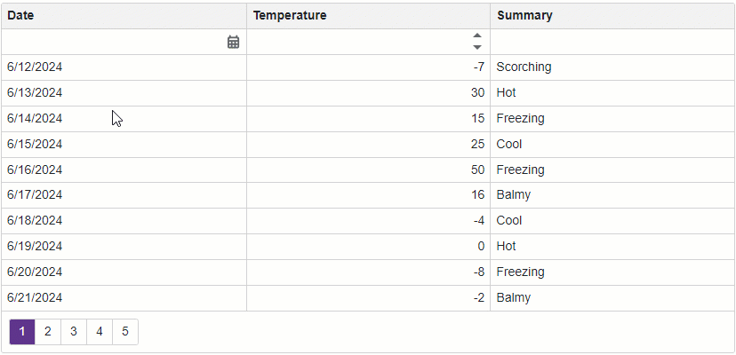

<!-- default badges list -->

<!-- default badges end -->
# Grid for Blazor - How to implement a date range filter

This example demonstrates how to allow users to filter a column in the [DevExpress Blazor Grid](https://docs.devexpress.com/Blazor/403143/grid) by a date range in a [filter row](./CS/Pages/FilterRow.razor) or [filter menu](./CS/Pages/FilterMenu.razor). In the example, the **Date** column contains a [Form Layout](https://docs.devexpress.com/Blazor/DevExpress.Blazor.DxFormLayout) with two [Date Edit](https://docs.devexpress.com/Blazor/DevExpress.Blazor.DxDateEdit-1) components. These components allow you to set the start and end dates of a date range. Once you set a date or both dates, the Grid filters the column by the specified range.

## Overview

Follow the steps below to allow users to filter a grid column by a date range:

1. Add a Grid component to a page and bind the component to data.

2. Display the Grid's [filter row](https://docs.devexpress.com/Blazor/DevExpress.Blazor.DxGrid.ShowFilterRow) or [filter menu](https://docs.devexpress.com/Blazor/DevExpress.Blazor.DxGrid.FilterMenuButtonDisplayMode).

3. Specify the template for the chosen filtering approach ([FilterRowCellTemplate](https://docs.devexpress.com/Blazor/DevExpress.Blazor.DxGridDataColumn.FilterRowCellTemplate) or [FilterMenuTemplate](https://docs.devexpress.com/Blazor/DevExpress.Blazor.DxGridDataColumn.FilterMenuTemplate)) for a column that displays dates. In the template, define context-specific component that processes filter (see [FilerRow.razor](./CS/Pages/DateRange-FilterRow.razor) and [FilerMenu.razor](./CS/Pages/DateRange-FilterMenu.razor) file).

4. Create a [base range component](./CS/Pages/DateRangeBase.razor) that contains two [Date Edit](https://docs.devexpress.com/Blazor/DevExpress.Blazor.DxDateEdit-1) components where users can set the start and end dates of a range.

5. Implement [two-way data binding](https://docs.devexpress.com/Blazor/402330/common-concepts/two-way-data-binding) between [Date](https://docs.devexpress.com/Blazor/DevExpress.Blazor.DxDateEdit-1.Date) properties of the Date Edit components and the data fields that store endpoints of the range.

6. Handle [DateChanged](https://docs.devexpress.com/Blazor/DevExpress.Blazor.DxDateEdit-1.DateChanged) events of the Date Edit components. In a component's event handler, assign the component's new value to the corresponding endpoint of the date range. Once at least one endpoint of the date range is set, update the filter criteria that determine whether the current value is in the range. Apply the filter criteria to the grid column.

## Files to Look At

- [DateRangeBase.razor](./CS/Pages/DateRangeBase.razor)
- [DateRange-FilterRow.razor](./CS/Pages/DateRange-FilterRow.razor)
- [DateRange-FilterMenu.razor](./CS/Pages/DateRange-FilterMenu.razor)

## Documentation

- [Filter Data in Blazor Grid](https://docs.devexpress.com/Blazor/404326/components/grid/data-shaping/filter-data/filter-data)
- [Examples](https://docs.devexpress.com/Blazor/404035/grid/examples)

## More Examples

- [Grid for Blazor - Incorporate a selector for filter row operator type](https://github.com/DevExpress-Examples/blazor-dxgrid-filter-operator-selector)
- [Grid for Blazor - Use the DxTagBox control to filter a column against multiple values](https://github.com/DevExpress-Examples/blazor-grid-use-the-DxTagBox-control-as-a-filter-for-a-column-with-multiple-values)
<!-- feedback -->
## Does this example address your development requirements/objectives?

 

(you will be redirected to DevExpress.com to submit your response)
<!-- feedback end -->
